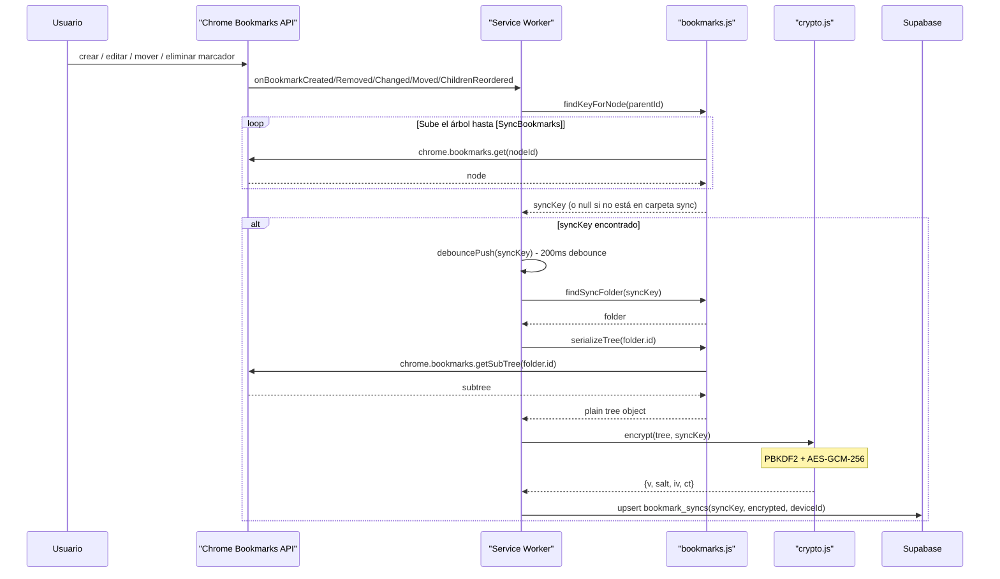

# Cambio local de marcadores → Push a Supabase

```mermaid
sequenceDiagram
    participant User as Usuario
    participant CB as "Chrome Bookmarks API"
    participant SW as "Service Worker"
    participant BM as "bookmarks.js"
    participant CY as "crypto.js"
    participant SB as Supabase

    User->>CB: crear / editar / mover / eliminar marcador
    CB->>SW: onBookmarkCreated/Removed/Changed/Moved/ChildrenReordered
    SW->>BM: findKeyForNode(parentId)
    loop Sube el árbol hasta [SyncBookmarks]
        BM->>CB: chrome.bookmarks.get(nodeId)
        CB-->>BM: node
    end
    BM-->>SW: syncKey (o null si no está en carpeta sync)
    alt syncKey encontrado
        SW->>SW: debouncePush(syncKey) - 200ms debounce
        SW->>BM: findSyncFolder(syncKey)
        BM-->>SW: folder
        SW->>BM: serializeTree(folder.id)
        BM->>CB: chrome.bookmarks.getSubTree(folder.id)
        CB-->>BM: subtree
        BM-->>SW: plain tree object
        SW->>CY: encrypt(tree, syncKey)
        Note over CY: PBKDF2 + AES-GCM-256
        CY-->>SW: {v, salt, iv, ct}
        SW->>SB: upsert bookmark_syncs(syncKey, encrypted, deviceId)
    end
```
