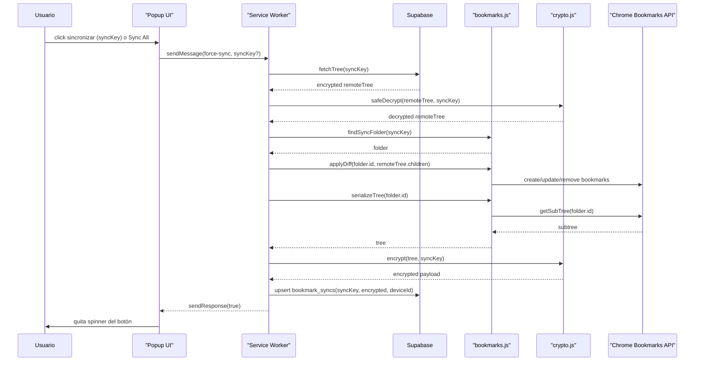

# Sincronización forzada (Force Sync)

```mermaid
sequenceDiagram
    participant User as Usuario
    participant PU as "Popup UI"
    participant SW as "Service Worker"
    participant SB as Supabase
    participant BM as "bookmarks.js"
    participant CY as "crypto.js"
    participant CB as "Chrome Bookmarks API"

    User->>PU: click sincronizar (syncKey) o Sync All
    PU->>SW: sendMessage(force-sync, syncKey?)
    SW->>SB: fetchTree(syncKey)
    SB-->>SW: encrypted remoteTree
    SW->>CY: safeDecrypt(remoteTree, syncKey)
    CY-->>SW: decrypted remoteTree
    SW->>BM: findSyncFolder(syncKey)
    BM-->>SW: folder
    SW->>BM: applyDiff(folder.id, remoteTree.children)
    BM->>CB: create/update/remove bookmarks
    SW->>BM: serializeTree(folder.id)
    BM->>CB: getSubTree(folder.id)
    CB-->>BM: subtree
    BM-->>SW: tree
    SW->>CY: encrypt(tree, syncKey)
    CY-->>SW: encrypted payload
    SW->>SB: upsert bookmark_syncs(syncKey, encrypted, deviceId)
    SW-->>PU: sendResponse(true)
    PU->>User: quita spinner del botón
```
