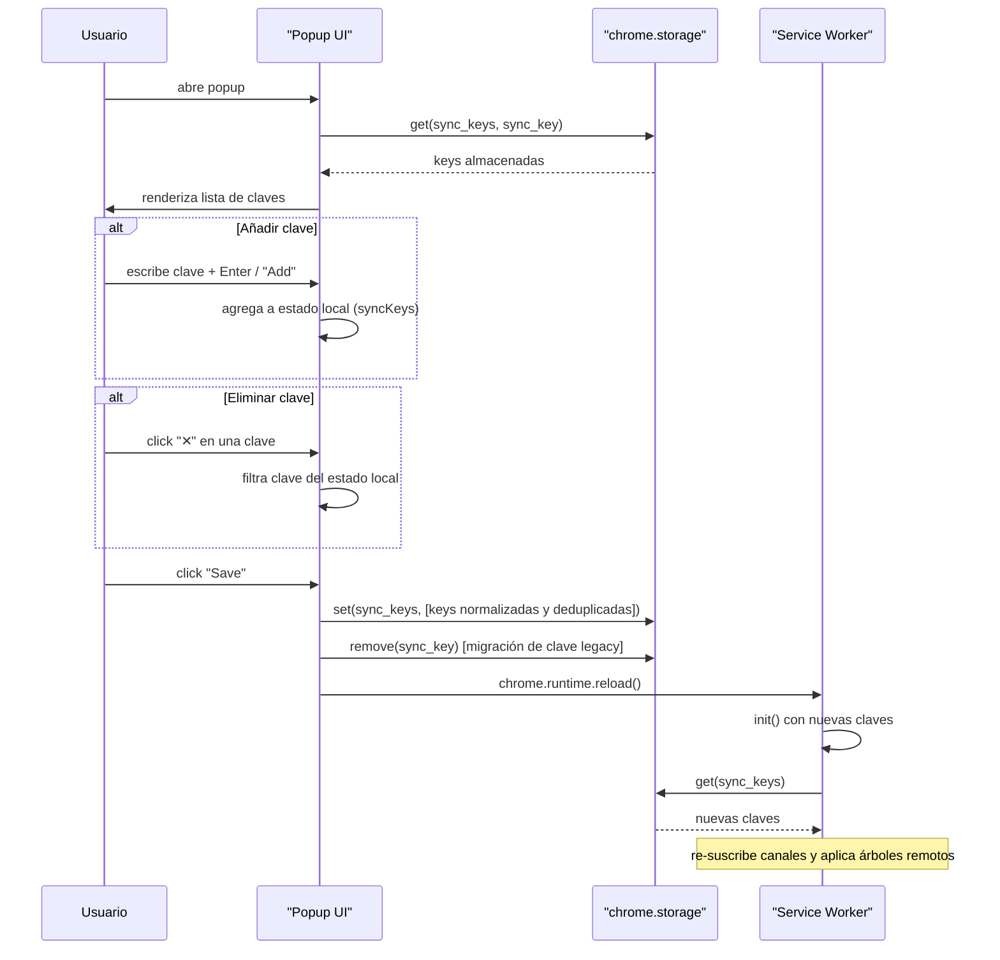

# Gestión de claves de sincronización (Popup)

```mermaid
sequenceDiagram
    participant User as Usuario
    participant PU as "Popup UI"
    participant CS as "chrome.storage"
    participant SW as "Service Worker"

    User->>PU: abre popup
    PU->>CS: get(sync_keys, sync_key)
    CS-->>PU: keys almacenadas
    PU->>User: renderiza lista de claves

    alt Añadir clave
        User->>PU: escribe clave + Enter / "Add"
        PU->>PU: agrega a estado local (syncKeys)
    end

    alt Eliminar clave
        User->>PU: click "✕" en una clave
        PU->>PU: filtra clave del estado local
    end

    User->>PU: click "Save"
    PU->>CS: set(sync_keys, [keys normalizadas y deduplicadas])
    PU->>CS: remove(sync_key) [migración de clave legacy]
    PU->>SW: chrome.runtime.reload()
    SW->>SW: init() con nuevas claves
    SW->>CS: get(sync_keys)
    CS-->>SW: nuevas claves
    Note over SW: re-suscribe canales y aplica árboles remotos
```
